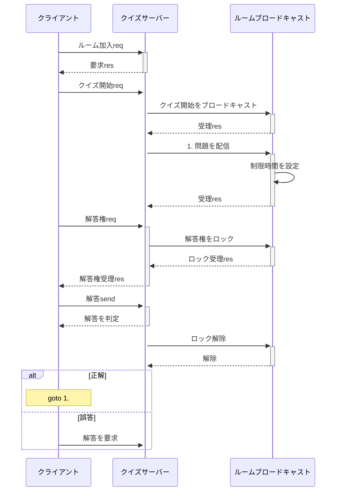

# main algorithm

## クイズセクション 状態遷移

# Client to Server

| コード            | 戻り値                 | 実行結果                     | 補足                                                                   |
| :---------------- | :--------------------- | :--------------------------- | ---------------------------------------------------------------------- |
| /join {room_name} | /join_ok or /join_err  | ルーム加入を試みる           |                                                                        |
| /start            | /quiz_started          | クイズセクションを開始する   | ルームに加入している場合のみ実行可能．これはルーム加入者全員に送られる |
| /ans_req          | /ans_ok or /ans_err    | 解答権を得る                 | 先着１名                                                               |
| /answer {解答}    | /correct or /incorrect | 解答に対しての正誤を判定する |                                                                        |

# Server to Client
| コード                          | 戻り値 | 実行結果                   | 補足                       |
| :------------------------------ | :----- | :------------------------- | -------------------------- |
| /quiz_started                   | なし   | クイズセクション開始を合図 | ルーム加入者全員に送られる |
| /question {limit_time} {問題文} | なし   |                            |                            |
| /ans_lock                       | なし   | 解答権をロックする         |                            |
| /ans_unlock                     | なし   | 解答権をアンロックする     |                            |
| /others_correct_answer {id} {answer}                    | なし   | 他ユーザの正解解答を通知する     |                            |
| /others_incorrect_answer {id} {answer}                    | なし   | 他ユーザの誤答解答を通知する     |                            |
| /users {user_json}              | なし   | ユーザ情報を配信         | 定期的に配信．型定義は以下 |

User {
    id,
    name,
    score
}