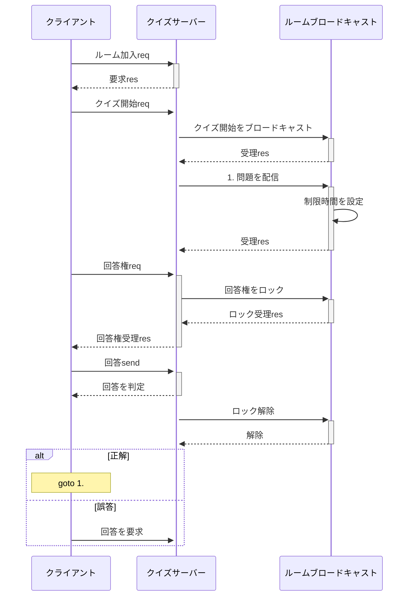
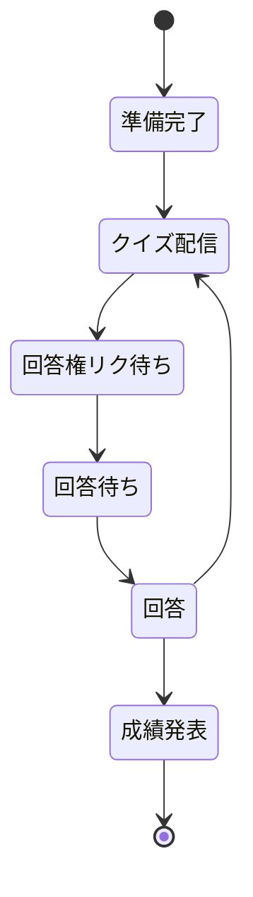

# main algorithm

```mermaid
sequenceDiagram
    participant cl as クライアント
    participant sv as クイズサーバー
    participant bl as ルームブロードキャスト

    cl ->>+ sv : ルーム加入req
    sv -->>- cl : 要求res
    cl ->>+ sv : クイズ開始req
    sv ->>+ bl : クイズ開始をブロードキャスト
    bl -->>- sv : 受理res
    sv ->>+ bl : 1. 問題を配信
    bl ->> bl : 制限時間を設定
    bl -->>- sv : 受理res
    cl ->>+ sv : 回答権req
    sv ->>+ bl : 回答権をロック
    bl -->>- sv : ロック受理res
    sv -->>- cl : 回答権受理res
    cl ->>+ sv : 回答send
    sv -->>- cl : 回答を判定
    sv ->>+ bl : ロック解除
    bl -->>- sv : 解除
    alt 正解 
        Note over cl : goto 1.
    else 誤答
        cl ->> sv : 回答を要求
    end
```

## クイズセクション 状態遷移

```mermaid
stateDiagram
    [*] --> 準備完了
    準備完了 --> クイズ配信
    クイズ配信 --> 回答権リク待ち
    回答権リク待ち --> 回答待ち
    回答待ち --> 回答
    回答 --> クイズ配信
    回答 --> 成績発表
    成績発表 --> [*]
    
```